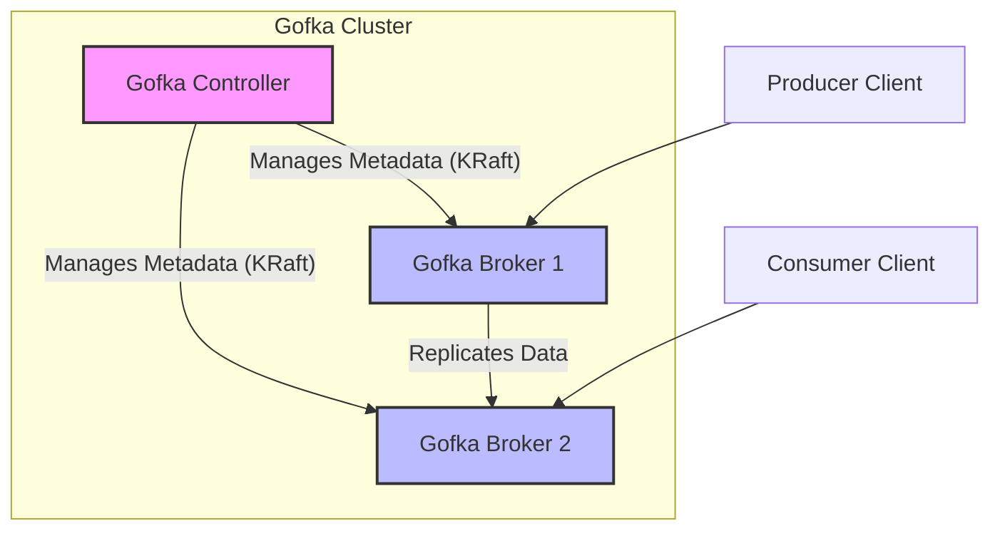

# Gofka: A Kafka-like System in Go

Gofka is an open-source project aiming to provide a distributed streaming platform similar to Apache Kafka, but implemented entirely in Go. This project is under active development and aims to offer high-throughput, fault-tolerant, and scalable message processing. It leverages the KRaft consensus protocol for robust metadata management.

## 1. Introduction

Gofka is designed to be a lightweight yet powerful message queuing system, drawing inspiration from Apache Kafka. Its primary goal is to provide a reliable and scalable platform for handling real-time data feeds, enabling applications to communicate asynchronously through message streams. Built entirely in Go, Gofka aims for high performance and operational simplicity.

## 2. Architecture Overview

Gofka's architecture is distributed, consisting of several key components that work together to provide a fault-tolerant and scalable messaging system. At its core, Gofka separates data plane (brokers) from control plane (controllers), with metadata managed by the KRaft consensus protocol.



## 3. Component Breakdown

### 3.1. Broker (`pkg/broker`)

The Gofka Broker is the workhorse of the system, responsible for storing messages, handling produce and consume requests, and maintaining topic partitions. Each broker is a node in the Gofka cluster.

*   **Message Handling:** Receives messages from producers and serves messages to consumers.
*   **Storage:** Persists messages to disk using a segment-based log approach.
*   **Partition Management:** Manages the lifecycle of topic partitions, including leader election and replication (planned).
*   **Integration with KRaft:** Uses the KRaft consensus protocol to fetch and update cluster metadata (e.g., topic configurations, partition assignments).

### 3.2. Controller (`cmd/gofka-controller`, `pkg/controller`)

The Gofka Controller is the control plane of the cluster. It is responsible for managing and maintaining the cluster's metadata, acting as the central authority for cluster-wide operations.

*   **Metadata Management:** Stores and manages critical information about topics, partitions, brokers, and their states.
*   **KRaft Consensus:** Leverages the KRaft protocol to ensure metadata consistency and fault tolerance across the cluster. The controller is a participant in the KRaft quorum.
*   **Cluster Coordination:** Handles tasks like topic creation, partition assignment, and rebalancing.

### 3.3. KRaft (`pkg/kraft`)

KRaft (Kafka Raft Metadata mode) is the consensus protocol used by Gofka for its metadata management. It replaces the traditional ZooKeeper dependency in Kafka, simplifying the architecture and improving scalability and resilience of the control plane.

*   **Distributed Consensus:** Ensures that all controller nodes agree on the state of the cluster metadata.
*   **Leader Election:** Automatically elects a leader among the controller nodes to manage metadata changes.
*   **Fault Tolerance:** Provides strong consistency and fault tolerance for metadata, allowing the cluster to operate even if some controller nodes fail.

### 3.4. Log (`pkg/log`)

The `log` package implements the segment-based log storage mechanism for topic partitions. Messages are appended to log segments, which are immutable files on disk.

*   **Segment Management:** Manages the creation, rotation, and deletion of log segments.
*   **Offset Management:** Assigns unique, sequential offsets to each message within a partition.
*   **Persistence:** Ensures messages are durably stored on disk.

### 3.5. Storage (`pkg/storage`)

The `storage` package provides an abstraction layer for persistent storage, primarily interacting with the local disk. It is used by the `log` package to write and read message data.

*   **Disk Persistence:** Handles low-level file operations for writing and reading data to and from disk.
*   **Pluggable Interface:** Designed to be potentially extensible to other storage backends in the future.

### 3.6. Network (`pkg/network`)

The `network` package handles the communication protocols between Gofka components (brokers, clients) and within the cluster. It provides a TCP server for handling client requests and internal communication.

*   **Request/Response Handling:** Manages the serialization and deserialization of requests and responses using Protocol Buffers.
*   **Connection Management:** Handles TCP connections and concurrent client interactions.

### 3.7. Client (`pkg/client`)

The `client` package provides the necessary components for applications to interact with the Gofka cluster.

*   **Producer:** Allows applications to send messages to Gofka topics. It handles message serialization, partitioning, and leader discovery.
*   **Consumer:** Enables applications to read messages from Gofka topics. It manages offset tracking and partition assignment.
*   **ClusterClient:** A utility client for discovering cluster metadata (brokers, topics, partitions) from any Gofka broker.

### 3.8. Streams (`pkg/streams`)

The `streams` package is intended to provide a stream processing library, similar to Kafka Streams. It allows users to define complex data transformations and aggregations over message streams.

*   **Design Guide:** Currently contains a detailed `README.md` outlining the architectural considerations for building a fault-tolerant and distributed stream processing engine.
*   **Foundational Interfaces:** Provides interfaces for Sources, Processors, Sinks, and State Stores, laying the groundwork for future implementation.

### 3.9. API (`api/v1`)

The `api/v1` directory contains the Protocol Buffer (`.proto`) definitions for all inter-component communication within Gofka. This ensures a well-defined and versioned communication contract.

*   **Schema Definition:** Defines the structure of requests and responses for operations like producing messages, consuming messages, and fetching metadata.
*   **Language Agnostic:** Protocol Buffers allow for generating client and server code in various programming languages.

## 4. Getting Started

To build and run the Gofka components, follow these steps:

### 4.1. Prerequisites

*   Go (1.20 or higher)
*   `protoc` (Protocol Buffer Compiler)
*   `protoc-gen-go` and `protoc-gen-go-grpc` (Go plugins for Protobuf)

### 4.2. Build Gofka Components

Navigate to the root of the Gofka project and run the following commands:

```bash
go mod tidy
go install google.golang.org/protobuf/cmd/protoc-gen-go@latest
go install google.golang.org/grpc/cmd/protoc-gen-go-grpc@latest
protoc --go_out=. --go_opt=paths=source_relative --go-grpc_out=. --go_opt=paths=source_relative api/v1/gofka.proto
go build -o /tmp/gofka-broker cmd/gofka-broker/main.go
go build -o /tmp/gofka-controller cmd/gofka-controller/main.go
go build -o /tmp/simple-producer examples/simple-producer/main.go
go build -o /tmp/simple-consumer examples/simple-consumer/main.go
```

### 4.3. Running Tests

Run the comprehensive test suite:

```bash
# Run all tests
go test ./...

# Run tests with coverage
go test -cover ./...

# Run tests for specific package
go test ./pkg/broker
go test ./pkg/log
```

### 4.4. Running the Cluster

1.  **Start the Gofka Controller:**
    Open a new terminal and run:
    ```bash
    /tmp/gofka-controller --node.id gofka-controller-1 --raft.addr localhost:19093 --raft.dir /tmp/gofka/controller-raft --bootstrap
    ```
    This will start the first controller node and bootstrap the KRaft cluster.

2.  **Start a Gofka Broker:**
    Open another terminal and run:
    ```bash
    /tmp/gofka-broker --node.id gofka-broker-1 --addr localhost:9092 --log.dir /tmp/gofka/broker-logs --raft.addr localhost:19092 --raft.dir /tmp/gofka/broker-raft --peers localhost:19093
    ```
    This will start a broker node, connecting it to the controller.

3.  **Create a Topic (Conceptual - requires Controller API):**
    Currently, topic creation is handled internally by the controller's KRaft FSM. For testing, you would typically interact with the controller via a dedicated API or CLI tool. For now, you can manually add a call to `b.CreateTopic` in `cmd/gofka-broker/main.go` after the broker starts for testing purposes, and then remove it.

4.  **Run the Simple Producer:**
    Open a new terminal and run:
    ```bash
    /tmp/simple-producer --broker localhost:9092 --topic test-topic --message "Hello from Gofka!" --partition 0
    ```

5.  **Run the Simple Consumer:**
    Open another terminal and run:
    ```bash
    /tmp/simple-consumer --broker localhost:9092 --topic test-topic --group my-consumer-group --partition 0
    ```

You should see the producer sending messages and the consumer receiving them.

## 5. Client Libraries

Gofka provides client libraries for multiple programming languages. Each client is maintained in a separate repository:

### Available Clients

- **Python**: [gofka-python](https://github.com/prashanth8983/gofka-python)
  - Synchronous and asynchronous APIs
  - Producer, Consumer, and Admin clients
  - Zero external dependencies
  - Installation: `pip install gofka`

### Coming Soon

- **Go**: In development
- **Node.js**: Planned

### Internal Go Client

The `pkg/client` package provides a Go client for internal use and examples. For production Go applications, we recommend waiting for the dedicated `gofka-go` client library.

## 6. Contributing

Contributions are welcome! Please refer to the contributing guidelines (to be added) for more information.
