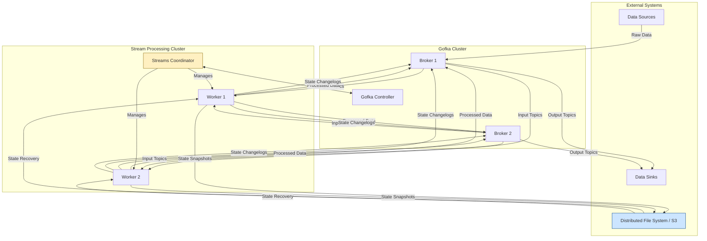
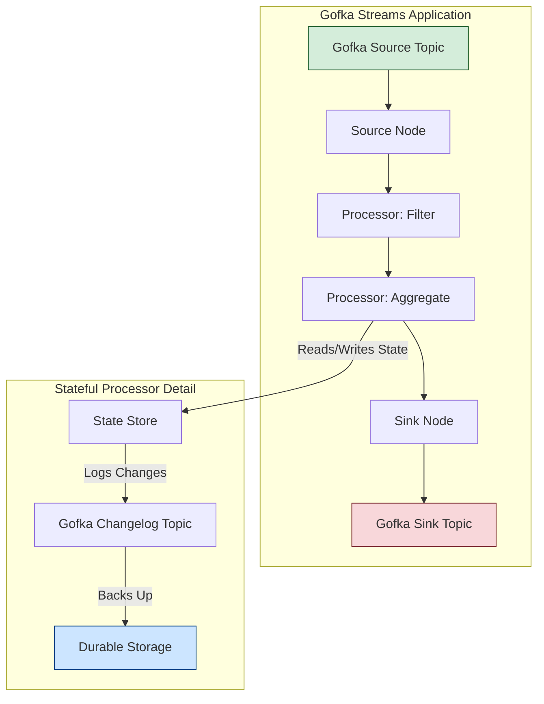
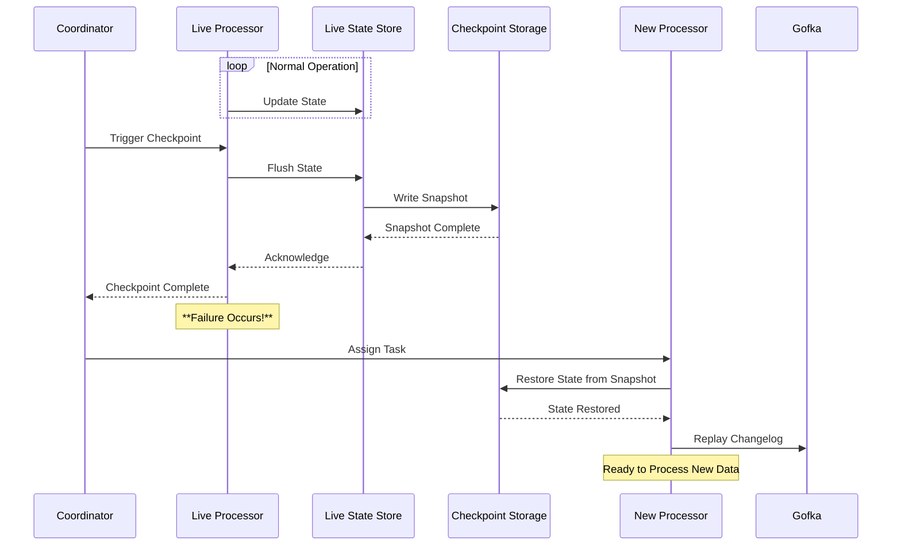

# Gofka Streams: Design and Implementation Guide

This document outlines the design and implementation considerations for an enterprise-grade, multi-node, fault-tolerant, and distributed stream processing library within Gofka. This is a highly complex undertaking, and this guide serves as a roadmap for its development.

## 1. Purpose

Gofka Streams aims to provide a robust framework for building continuous, real-time data processing applications. It will enable users to define complex data transformations, aggregations, and joins over unbounded streams of data, leveraging Gofka's core messaging capabilities.

## 2. Core Concepts

At its heart, a Gofka Streams application is a `Topology`—a directed acyclic graph (DAG) that defines the flow of data and the processing logic.

### 2.1. Topology

A `Topology` defines the directed acyclic graph (DAG) of stream processing operations. It represents the flow of data from input sources, through various processing steps, to output sinks.

*   **Nodes:** Represent individual processing steps (Source, Processor, Sink).
*   **Edges:** Represent the data flow between nodes.

### 2.2. Nodes in Detail

*   **Source Nodes:** These are the entry points of the topology. They connect to Gofka brokers, consume messages from their assigned topic partitions, and emit them into the processing graph. Each source node wraps a `client.Consumer` and is responsible for offset management.

*   **Processor Nodes:** These nodes perform the actual data transformations.
    *   **Stateless Processors:** Operate on each message independently (e.g., filtering, mapping).
    *   **Stateful Processors:** Maintain internal state across messages (e.g., aggregations, joins). This state must be managed in a fault-tolerant manner.

*   **Sink Nodes:** These are the exit points of the topology. They consume messages from upstream nodes and write them to a destination, such as a Gofka topic or an external database. Each sink node typically wraps a `client.Producer`.

### 2.3. State Stores

A `StateStore` provides a durable, fault-tolerant mechanism for stateful processors to manage their internal state.

*   **Responsibilities:** Persist key-value data, support atomic updates, and enable state recovery after a failure.
*   **Implementation Strategy:**
    *   **Local Storage:** Utilize an embedded key-value store like RocksDB for high-performance local access.
    *   **Changelog Topics:** Every state change is written to a compacted Gofka topic. This log acts as the source of truth, allowing for the complete reconstruction of state on a new machine.
    *   **Distributed Snapshots:** Periodically, the state from the local store is snapshotted and saved to durable, distributed storage (e.g., S3, HDFS).

## 3. Distributed Architecture

Gofka Streams is designed to run as a distributed system, scaling across multiple nodes to handle large data volumes.

*   **Stream Application Instances (Workers):** Each running instance of a Gofka Streams application is a worker. These workers execute a subset of the processing tasks in parallel.

*   **Streams Coordinator:** A central component responsible for managing the cluster. This could be a dedicated service or leverage the Gofka Controller. Its duties include:
    *   Discovering and monitoring worker instances.
    *   Assigning processing tasks (e.g., topic partitions) to workers.
    *   Coordinating rebalancing when workers join, leave, or fail.
    *   Managing global state checkpoints.

*   **Partitioning:** Data is partitioned by key, ensuring that all records for a given key are processed by the same worker instance. This is critical for stateful operations.

### 3.1. Overall System Architecture



### 3.2. Stream Processing Topology Flow



## 4. Fault Tolerance & Processing Guarantees

Fault tolerance is a cornerstone of the design, ensuring no data is lost and processing continues despite failures.

### 4.1. Checkpointing and Recovery

The system uses a coordinated checkpointing mechanism to achieve fault tolerance.

*   **Checkpoint Trigger:** The Coordinator periodically initiates a checkpoint by injecting special barrier messages into the input streams.
*   **State Snapshot:** When a worker receives a barrier on all of its input streams, it signifies a consistent point in time. The worker then flushes its local state stores and asynchronously writes a snapshot to durable storage (e.g., S3).
*   **Acknowledgement:** After successfully saving the snapshot, the worker acknowledges the checkpoint to the Coordinator.
*   **Recovery:** If a worker fails, the Coordinator reassigns its tasks to a healthy worker. The new worker restores its state from the latest successful checkpoint in durable storage and begins consuming from the Gofka changelog topics to catch up on any changes made since the snapshot was taken.

### 4.2. Checkpointing & Recovery Flow



### 4.3. Processing Guarantees

*   **At-Least-Once:** Every record is guaranteed to be processed at least once. This is achieved through the checkpoint-and-replay mechanism. Downstream systems should be designed to handle potential duplicates (i.e., be idempotent).

*   **Exactly-Once:** Achieving this is a significant challenge and requires end-to-end transactional guarantees. It involves:
    *   **Transactional Sinks:** Using two-phase commits to ensure that output is only committed if the entire processing batch is successful.
    *   **Idempotent State Updates:** Ensuring that re-processing a message does not corrupt state.

## 5. API Design (High-Level)

The public API should be intuitive and fluent, allowing developers to easily define complex topologies.

```go
// StreamsBuilder provides the main entry point for defining a topology.
type StreamsBuilder struct {
    // ... internal state
}

func NewBuilder() *StreamsBuilder { /* ... */ }

// From defines a source node that consumes from a topic.
func (b *StreamsBuilder) From(topic string) *Stream { /* ... */ }

// Stream represents a data stream within the topology.
type Stream struct {
    // ... internal state
}

// Filter applies a filtering function to the stream.
// The function returns true to keep the message.
func (s *Stream) Filter(f func(key, value []byte) bool) *Stream { /* ... */ }

// Map transforms each message in the stream.
func (s *Stream) Map(f func(key, value []byte) (newKey, newValue []byte)) *Stream { /* ... */ }

// GroupByKey groups the stream by key, preparing for an aggregation.
func (s *Stream) GroupByKey() *GroupedStream { /* ... */ }

// To defines a sink node that produces to a topic.
func (s *Stream) To(topic string) { /* ... */ }

// GroupedStream represents a stream that has been grouped by key.
type GroupedStream struct {
    // ... internal state
}

// Aggregate performs a stateful aggregation.
// It requires an initializer, an adder, and a state store definition.
func (g *GroupedStream) Aggregate(
    initializer func() []byte,
    adder func(agg, value []byte) []byte,
    store StateStoreConfig,
) *Stream { /* ... */ }

// Build constructs the final, immutable Topology.
func (b *StreamsBuilder) Build() (*Topology, error) { /* ... */ }

// Example Usage:
// builder := NewBuilder()
// builder.From("user-clicks").
//     Filter(isRealClick).
//     Map(extractUserInfo).
//     GroupByKey().
//     Aggregate(initCounter, incrementCounter, RocksDBStore("click-counts")).
//     To("user-click-counts")
// topology, _ := builder.Build()
```

## 6. Future Work and Challenges

This guide lays the foundation. Key areas for future development include:

*   **Advanced Windowing:** Implementing time-based (tumbling, hopping, sliding) and count-based windowing for aggregations.
*   **Stream Joins:** Supporting joins between multiple streams (Stream-Stream) and between a stream and a table (Stream-Table).
*   **Complex Event Processing (CEP):** Adding capabilities to detect complex patterns across sequences of events.
*   **Backpressure Management:** Implementing mechanisms to prevent downstream operators from being overwhelmed by faster upstream operators.
*   **Metrics and Monitoring:** Exposing detailed performance metrics for monitoring and alerting.
*   **Schema Management:** Integrating with a schema registry to handle schema evolution gracefully.
*   **Security:** Implementing robust authentication and authorization for all components.
*   **Deployment and Orchestration:** Providing tools and guides for seamless deployment on platforms like Kubernetes.

This guide provides a foundational understanding. Each section represents a significant area of design and implementation that requires careful consideration and iterative development.
